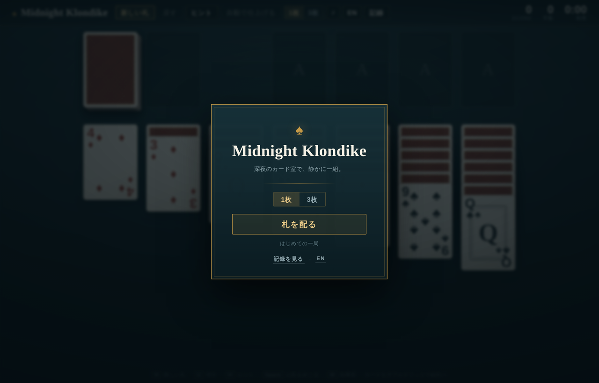
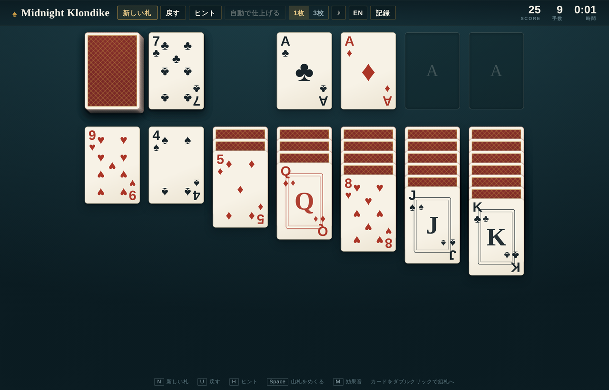

# Midnight Klondike

A quiet hand in the late-night card room — Klondike solitaire in a single HTML file.
No build step, no dependencies, no tracking. Open the file and play.

**[▶ Play](https://YOUR-USERNAME.github.io/midnight-klondike/)**



---

## Features

- **Real card faces.** Proper pip layouts for every number card, engraved-style courts, and a letterpress paper stock. On small screens the faces simplify automatically so the index stays readable.
- **Drag, click or double-click.** Drag a card or a whole sequence, click to send it to the best spot, double-click to send it home.
- **Undo, hint, auto-finish.** Unlimited undo. The hint looks for the move that actually helps — foundation plays first, then moves that reveal a face-down card. Auto-finish appears once every card is face up.
- **Synthesised sound.** No audio files. Paper rustle is filtered noise, the foundation chime is stacked sine waves, and the pitch climbs one step for every card sent home. Toggle with `M`.
- **Stats that mean something.** Win rate, best score, fastest time, fewest moves, current and best streak, separate win rates for draw 1 and draw 3, and a bar chart of your last twelve games.
- **Japanese / English.** Detected from the browser on first run, remembered after that.
- **Draw 1 or draw 3**, standard Windows-style scoring, and a bouncing-card finish when you clear the board.



## Controls

| | |
|---|---|
| `N` | New deal |
| `U` | Undo |
| `H` | Hint |
| `Space` / `D` | Draw from the stock |
| `A` | Auto-finish |
| `M` | Sound on / off |
| Click a card | Move it to the best available spot |
| Double-click | Send it to the foundation |
| Drag | Move a card or a whole sequence |

## Scoring

| | |
|---|---|
| Send a card home | +10 |
| Turn a face-down card | +5 |
| Waste → tableau | +5 |
| Take a card back from home | −15 |
| Recycle the stock (2nd pass on) | −20 |
| Time bonus on winning | 1000 − seconds × 2 |

## Running it

It is one file. Any of these work:

```bash
# just open it
open index.html

# or serve it, if you prefer a real origin for localStorage
python3 -m http.server 8000
```

## Publishing with GitHub Pages

1. Push this repository to GitHub.
2. **Settings → Pages → Source: Deploy from a branch → `main` / `/ (root)`**
3. It goes live at `https://<user>.github.io/midnight-klondike/` in a minute or two.

Nothing else is needed — there is no build.

## Notes

- Records are kept in `localStorage` on the device, per browser. Nothing is sent anywhere.
- Bodoni Moda and Barlow are loaded from Google Fonts; everything else — card art, sounds, layout — is generated in the page. Offline, the type falls back to Georgia and a system sans and the game still plays.
- Tested in current Chrome, Safari and Firefox, desktop and mobile.

## License

MIT — see [LICENSE](LICENSE).

---

<details>
<summary>日本語</summary>

## Midnight Klondike

深夜のカード室で、静かに一組。HTML 一枚で完結するクロンダイク・ソリティアです。ビルドも依存も計測もありません。開けば遊べます。

### できること

- **本物の札の顔** — 数札はピップを正しく配置し、絵札は彫版風の枠、紙は活版の風合い。画面が小さいときは自動で簡素な絵柄に切り替わり、位取りが読めるようにしています。
- **ドラッグ／クリック／ダブルクリック** — 連なりごと掴めます。クリックで最適な場所へ、ダブルクリックで組札へ。
- **戻す・ヒント・自動で仕上げる** — アンドゥは無制限。ヒントは「組札へ送れる手 → 裏の札をめくれる手」の順に、本当に効く手だけを光らせます。
- **効果音はその場で合成** — 音源ファイルを持たず、紙の擦れはフィルタしたノイズ、組札の鐘は正弦波の重ね。組札へ送るたびに音が一段ずつ上がります（`M` で切替）。
- **記録** — 勝率、最高スコア、最短時間、最少手数、連勝、1枚／3枚それぞれの勝率、直近12戦の棒グラフ。
- **日本語 / English** — 初回はブラウザの言語で判定し、以後は選んだほうを覚えます。

### 遊び方の要点

場札の並べ方はクロンダイクと同じ（色違いの降順、空き列には K）。`Space` で山札をめくり、`U` で戻し、`H` でヒント。記録はこの端末のブラウザにだけ保存されます。

### GitHub Pages で公開する

**Settings → Pages → Source: Deploy from a branch → `main` / `/ (root)`** を選ぶだけです。ビルドはありません。

</details>
